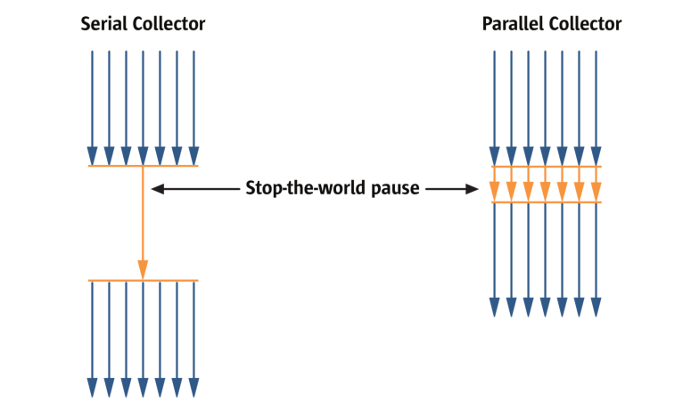
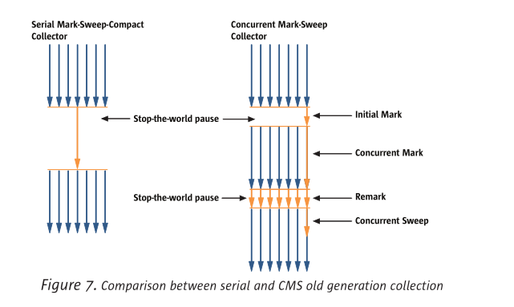

[toc]

# 介绍

JDK2的一个特点，通过内存自动管理，从而为程序猿屏蔽显式管理内存的复杂性。

本文概述了Sun’s J2SE 5.0 release版本HotSpot虚拟机的内存管理。它描述了垃圾收集器对内存自动管理的作用，并且提供了一些关于选择、配置垃圾收集器以及设置内存区域大小的建议。同时它也作为一本资源书，提供一些影响垃圾收集器行为的常用操作以及更详细的相关的文档链接。

-   章节2讲解一些内存自动管理的概念，里面有一个简短的讨论，关于内存自动管理对比显示内存管理的好处。

-   章节3提供关于垃圾收集概念，设计选型，以及性能指标的概述。其中介绍了基于对象生命周期划分内存区域的”分代“（generations）。这种内存分代的方式已经在广泛的应用中被证明能有效减少GC停顿时间以及总成本。

>    剩余的章节均基于HotSpot JVM

-   章节4介绍了4种可用的垃圾收集器，以及这些垃圾收集器使用到分代中那些内存区域、使用到的垃圾收集算法。

-   章节5描述了一种JDK5中的新技术，它集合自动选择垃圾收集器，自动设置堆大小等。

-   章节6提供一些关于选择、配置垃圾收集器的建议，同时也提供一些关于OOM的处理思路。

-   章节7介绍了一些可以用于监控GC性能的工具。

-   章节8列出了最常用的跟垃圾收集器的选择与行为相关的命令行参数。

-   章节9提供一些相关的详细的文档链接

# 内存自动管理 VS 手动管理

内存管理是识别和释放不再需要已分配对象的过程。

在某些编程语言中，内存管理是程序猿的责任。这项复杂的任务通常会导致许多常见的错误，从而引发程序错误、崩溃。最终导致，程序猿需要花费大量的时间去调试，纠正这些错误。

手动管理内存中常见的一个问题就是“迷途引用”。迷途引用很有可能会释放其他对象引用的内存空间。如果想要通过迷途引用访问原对象，但是此时引用对应的区域已经重新分配给别的对象，那么会造成不可预测的结果。

> [维基百科 - 迷途指针](https://zh.wikipedia.org/wiki/%E8%BF%B7%E9%80%94%E6%8C%87%E9%92%88)

手动管理内存中另一个常见的问题是内存泄漏。内存泄漏是指内存被分配后，当对象不再有引用时，内存不释放的现象。简单举个例子，当你想要释放一个链表占用的空间时，你错误地只释放了链表中的第一个元素，链表中雨鞋的元素不再被引用，但同时也超出程序的掌控，无法复用这块内存，也无法释放这块内存。如果内存泄漏问题足够大，它会持续吞噬内存直到内存资源耗尽。

目前普遍通过垃圾收集器进行内存自动管理，尤其是面向对象编程语言。内存自动管理可以增加接口的抽象和更多可靠的代码。

垃圾回收机制解决了迷途引用问题和内存泄漏问题。

# 垃圾回收相关概念

## 垃圾收集器的作用

- 分配内存
- 确保被引用的对象在内存中存活
- 回收引用不可达的对象

如果对象被引用，则可以说对象存活。不再被引用的对象可以被认为是死的，称为垃圾。寻找和释放这些垃圾对象占用内存的过程就是垃圾回收。

垃圾回收机制可以解决很多问题，但不是所有问题，比如说内存分配问题。简单举个例子，你可以无限地创建对象并持续地引用它们直到内存消耗殆尽。垃圾回收同样也是一项复杂的任务，它需要一定的时间和资源。

垃圾回收算法由垃圾收集器控制，用于分配和释放内存。内存分配在堆上进行。

进行垃圾收集的时机取决于垃圾收集器。通常，当堆被填满或者占用达到百分比阈值的时候，将进行垃圾回收。

进行内存分配比较困难的一点是，在堆中找到一个特定大小的未使用内存块。大多数动态内存分配算法主要的问题在于，如何在保证内存分配和释放的效率的情况下，避免产生内存碎片的问题。

## 理想的垃圾收集器应该具备的特点

- 安全：存活的对象不被释放，垃圾对象不会被保留
- 高效运行
- 尽可能减少内存碎片的产生
- 可伸缩性

## 设计选型

> 在设计和选择垃圾回收算法的时候，有几个地方需要考量

- 单线程 VS 多线程
- 并发 VS SWT
- 整理内存碎片 VS 不整理内存碎片 VS 复制内存

## 性能指标

- 吞吐量
- 成本（吞吐量的倒数）
- 停顿时间
- 频率
- 空间
- 效率：对象从被标记为垃圾到占用内存被释放所需要的时间

## 分代回收

在不同的分代中会使用不同的垃圾回收算法进行垃圾回收，每个算法都是基于特定分代的常见特点进行优化。

分代回收基于两点：

- 大部分对象朝生暮死
- 从旧对象到年轻对象的引用很少

年轻代经常发生GC，但GC很快，这是因为年轻代空间通常比较小，并且包含大量的已死（垃圾）对象。

对象经历过几次年轻代GC后会晋升到老年代。老年代通常比年轻代大得多，同时老年代的内存占用增长比年轻代慢很多，所以老年代的GC比较少见，但是每次执行老年代GC都需要相对较长的时间。

**年轻代进行GC选择垃圾回收算法的关注点是速度。**

**老年代进行GC选择垃圾回收算法的关注点是空间。**

# HotSpot中的垃圾收集器

在J2SE5.0 update6 版本中，HotSpot JVM包含四种垃圾收集器（都是分代回收）。

本章节讨论内存区域分代以及垃圾回收的类型，并且阐述对象的内存分配为何快速高效。

## HotSpot中的分代

HotSpot JVM的内存被划分成三部分：

- 年轻代
- 老年代
- 永久代

绝大多数对象的内存分配在年轻代中进行。
老年代中包含的对象一般是经历过数次年轻代垃圾回收，或者是大对象。
永久代中包含了便于垃圾收集器管理的对象，例如描述类和方法的对象，以及类和方法本身。

年轻代包含一个eden区，两个survivor区。对象在eden区分配内存，survivor区包含最少经历过一次Young GC的对象，survivor区给予了对象在晋升到老年代之前死亡的机会。
两个survivor区，总是一个存放Young GC后存活的对象，另一个则是空区域。

## 垃圾回收的类型（GC类型）

当年轻代被填满，会执行Young GC。
当老年代被填满，会执行Full GC，这表示，所有的分代都会进行垃圾回收。
通常，年轻代先执行垃圾回收，然后是老年代和永久代，如果需要进行压缩（内存碎片），则由每一代单独进行。

## 内存快速分配

使用bump-the-pointer技术使得内存分配变得高效，因为会记录每次分配的对象的末尾。
每当需要进行内存分配的时候，所需要做的仅仅是检查分代中剩余的空间是否满足对象所需内存大小。如果满足，则更新bump-pointer和给对象分配内存就行了。

对于多线程应用，内存分配操作必须是线程安全的。如果使用全局锁来确保bump-pointer的线程安全，那么这将会成为内存分配的性能瓶颈。
HotSpot JVM采用一种技术，叫TLABs（Thread-Local Allocation Buffers），通过给每个线程分配一个小的缓冲区来提升多线程内存分配的吞吐量。
因为缓冲区是线程独有的，所以在多线程进行内存分配的时候，不需要上锁，可以使用bump-the-pointer技术实现内存快速分配。
只有在缓冲区用完了需要获取一个新的缓冲区的时候，才需要用到锁。

有几种方式减少TLABs占用的内存，例如：缓冲区不能超过eden区的1%。TLABs + bump-the-pointer技术使得内存分配变得异常高效，大约只需要10几个本地机器指令。

## 串行收集器

串行收集器意味着在进行垃圾回收的时候，程序会进入stop-the-world，年轻代和老年代的垃圾回收都是串行执行。

### 在年轻代中使用串行收集器

eden区中的存活的对象会被复制到to-survivor区，如果对象太大，会直接进入老年代。
from-survivor区中的对象如果比较年轻，则会被复制到to-survivor区，否则会被复制到老年代。
如果to-survivor区满了，那么eden区和from-survivor区中的对象都会晋升到老年代，不管他们经历过多少次Young GC。

### 在老年代中使用串行收集器

使用串行收集器，老年代和永久代使用标记-清除-整理算法。

### 什么时候使用串行收集器

串行收集器适用于运行client模式的，没有低停顿时间要求的应用程序。

### 串行收集器的选择

在J2SE 5.0 release版本，client模式的应用程序默认选择串行收集器，可以通过参数-XX:+UseSerialGC显示指定使用串行收集器。

## 并行收集器

现在，很多Java应用程序都运行在大内存、多CPU的机器上。并行收集器（吞吐量收集器）是为了提高CPU利用率而研发的。

### 年轻代使用并行收集器

使用串行收集器（在多CPU的环境下）可以减少GC成本以及增加应用程序吞吐量。

### 老年代使用并行收集器

跟老年代的串行收集器一样。

### 什么时候使用并行收集器

并行收集器能够发挥出多CPU的优势。

### 选择并行收集器

在J2SE 5.0 release版本，server模式的应用程序默认选择并行收集器，可以通过参数-XX:+UseParallelGC显示选择

## 并行压缩收集器

与并行收集器的区别在于，并行压缩收集器在老年代的垃圾回收中使用了一种新的垃圾回收算法（并行压缩收集器终将取代并行收集器）

### 年轻代使用并行压缩收集器

跟年轻代的并行收集器一样

### 老年代使用并行压缩收集器

进行垃圾回收的时候有三个阶段：

- 第一阶段，每个分代都被逻辑分割成合适的大小region
- 第二阶段（标记阶段），多线程并行标记存活对象
- 第三阶段，操作的是region而不是对象。由于压缩的缘故，在分代的左侧区域包含的大多数都是存活的对象，对这部分区域进行压缩的收益不高。所以在第三阶段首先要做的是检查region的密度（从最左侧开始），直到找到某个region边界，在这个边界的左侧，不需要进行压缩，在这个边界的右侧，需要进行压缩。（目前第三阶段是串行执行的，并行执行对性能提升不显著）

### 什么时候使用并行压缩收集器

并行压缩收集器受益于多CPU，能够减少停顿时间，比并行收集器更合适对停顿时间有要求的应用程序。不过并行收集器并不合适于一台机器上运行多个应用程序，对于这些机器，可以考虑减少垃圾回收线程数量或者选择别的垃圾收集器

## CMS垃圾收集器

对于很多应用来说，端到端的吞吐量不如响应时间重要。年轻代GC通常不会导致长时间停顿，但是老年代GC可以，尽管老年代GC并不常见。为了解决这个问题，HotSpot JVM引入CMS垃圾收集器。

## 年轻代使用CMS垃圾收集器

CMS垃圾收集器回收年轻代垃圾所使用的方法跟年轻代的并行垃圾收集器相同。

### 老年代使用CMS垃圾收集器

使用CMS垃圾收集器，运行应用程序和垃圾回收并发进行。

CMS垃圾回收阶段

- 初始标记：STW，短暂停顿，标记出与应用程序代码直接关联的存活对象集合，单线程运行
- 并发标记：标记跟初始标记存活对象集合关联的存活对象，不会STW
- 重新标记：在并发标记期间被修改过的对象进行再次检查，多线程运行，STW
- 并发清除：清除所有被标记为垃圾的对象

CMS是唯一一个不会在GC后进行压缩的垃圾收集器，这虽然省时间，但是CMS无法使用bump-the-pointer技术来实现内存快速分配，所以CMS需要承担存储空闲内存区域列表的成本。这同时影响了Young GC的性能。

CMS的另一个缺点比其他的收集器要求更大的堆内存，以保证应用程序在标记阶段可以正常运行，持续创建对象，同时持续往老年代中丢垃圾。除此之外，尽管CMS会在标记阶段标记出所有的垃圾对象，但是仍然会有对象成为垃圾没有被清理直至下一次垃圾回收，这些对象统称为浮动垃圾。

最后，为了解决内存碎片问题，CMS会跟踪常见对象的内存大小，预测未来的需求，可能分隔/合并空闲区域来满足内存分配。

不同于其他的收集器，CMS不会等待老年代满了以后才会执行垃圾回收。如果CMS进行垃圾回收失败，则会使用更加耗时的并行/串行收集器进行垃圾回收。为了避免这点，CMS触发垃圾回收的时间点基于前面GC时长的统计和老年代垃圾的增长速率。如果老年代的空间占用率超过了初始占用，也会触发CMS进行垃圾回收。默认情况下，初始占用为68%，由参数–XX:CMSInitiatingOccupancyFraction控制。

总的来看，相比于并行垃圾收集器，CMS能够显著减少老年代垃圾回收的停顿时长，不过这是以稍微延长年轻代的垃圾回收停顿时长作为代价，以及吞吐量、额外的堆内存消耗。

### 增量模式

CMS可以在并发阶段使用增量模式。这个模式是通过周期性地停止并发阶段，让出处理器给应用程序来减少并发阶段长期执行带来的影响。CMS在垃圾回收的时候将时间划分为多个小块，这些小块夹杂在年轻代的垃圾回收中。这对于运行在处理器数量小，对于GC停顿时间有要求的应用程序是有效的。关于此模式用法的详细信息，请参照章节9。

### 何时使用CMS收集器

如果应用程序对于垃圾回收的停顿时间有要求，并且机器能够负担额外的CPU消耗（垃圾回收和应用并发进行，共享CPU资源），那么可以选择CMS收集器。通常，如果应用程序存在大量的长期存活对象（在old区）并且应用程序运行在多核处理器上，那么使用CMS收集器能够获取更好的性能。

### CMS收集器选项

如果你想使用CMS收集器，你可以显示指定命令行参数`-XX:+UseConcMarkSweepGC`。如果你想要使用增量模式，也可以通过命令行参数，`–XX:+CMSIncrementalMode`。

# JVM中的人机工程学（自动选择和行为调优）

> [ERGONOMIC在剑桥英语词典中的解释及翻译](https://dictionary.cambridge.org/zhs/%E8%AF%8D%E5%85%B8/%E8%8B%B1%E8%AF%AD/ergonomic)

在J2SE 5.0 release版本，垃圾收集器、堆大小以及HotSpot JVM的默认值都是基于应用程序运行的平台和操作系统而自动选择的。这些自动选择能够更好地匹配不同类型的应用程序的需要，而所需要的命令行参数比之前的版本要少。

除此之外，在并行收集器中添加了一种新的动态调整的方式。通过这种方式，用户指定所需的行为，垃圾收集器动态调整堆大小，以尝试实现所请求的行为。

人机工程学 = 基于平台的自动选择 + 垃圾收集器的行为调优

人机工程学的目标是通过更少的参数配置提供更好的性能表现。

## 垃圾收集器、堆大小以及JVM的自动选择

服务器级别的机器定义：

- 2个或以上的处理器
- 2G或以上的物理内存

> 这个定义适用于所有平台，除了32位的windows系统

非服务器级别机器的JVM、垃圾收集器以及堆大小的默认值：

- client模式的JVM
- 串行收集器
- 初始堆大小4MB
- 最大堆大小64MB

在服务器级别的机器上，JVM默认选择server模式，除非显示使用-client参数指明使用client模式。在服务器级别的机器上以server模式运行JVM，默认的垃圾收集器是并行收集器，除此之外其他的默认值都是串行收集器。

在服务器级别的机器上运行使用并行收集器的JVM（不管是server模式还是client模式），默认的堆大小如下：

- 初始堆大小为服务器的物理内存的1/64，最大是1G
- 最大堆大小为服务器的物理内存的1/4，最大是1G

另外，非服务器级别的机器初始堆大小是4MB，最大堆大小是64MB。默认值可以被JVM参数配置覆盖，相关的参数配置可以查看章节8.

## 并行收集器上的行为调优

在J2SE 5.0版本中，添加了一种并行收集器的调优方式，该方式基于应用程序和垃圾回收相关的所需行为。

### 目标最大停顿时间

参数：-XX:MaxGCPauseMillis=n

这相当于给并行收集器一个提示，要求停顿时间小于等于n毫秒。并行收集器会尝试调整堆大小以及垃圾回收相关的参数，力求让停顿时间小于n毫秒。这些调整有可能会导致应用程序整体吞吐量降低，同时在某些场景下，不一定能够把停顿时间控制在参数配置之内。

目标最大停顿时间分别应用于每一个分代。通常来说，如果停顿时间不能小于设定的目标，各个分代会尝试变得更小去达成这个目标。在默认情况下是没有设置最大停顿时间。

### 目标吞吐量

吞吐量是由GC时间和应用程序（非GC时间）测量。

参数：-XX:GCTimeRatio=n

垃圾收集时间与应用程序之比为： 1/(1+n)

> 举个例子，如果-XX:GCTimeRatio=19，那么表示垃圾回收时间占总体时间的5%。

默认目标吞吐量为1%，也就是n=99。

如果不能达到目标吞吐量，那么会通过增加各个分代的大小来增加应用程序运行时间的占比。

### 目标占用空间

如果目标吞吐量和目标最大停顿时间都能被满足，那么垃圾收集器将减少堆的大小直到其中一个目标不被满足。

### 目标优先级

停顿时间 > 吞吐量 > 占用空间

# 英文版地址

[Memory Management in the Java HotSpot™ Virtual Machine](https://www.oracle.com/technetwork/java/javase/tech/memorymanagement-whitepaper-1-150020.pdf)