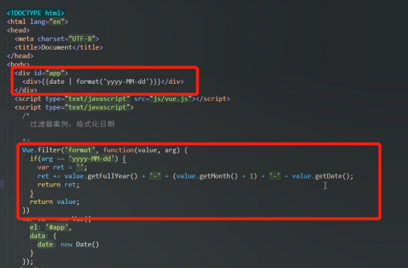

[toc]

# 概述

Vue：渐进式JavaScript框架

Vue使用进阶：

声明式渲染 -> 组件系统 -> 客户端路由 -> 集中式状态管理 -> 项目构建

# 基本使用 

## 传统开发模式对比


> JQ对JS封装，提高了易用性


- el表示元素的挂载位置（值可以是CSS选择器或者DOM元素）
- data表示模型数据
- {{xxx}}表示插值表达式，可以将数据填充到HTML标签，同时支持基本的计算操作


> 编译过程

## 模板语法


前端渲染的方式：

- 原生JS拼接字符串（代码可读性差，维护困难）


- 使用前端模板引擎（代码可读性好，但是没有专门提供事件机制）


- 使用Vue的模板语法

### 指令

- 指令的本质就是自定义属性
- 指令格式：v-xxx

#### v-cloak

解决插值表达式的“闪动”问题

> “闪动”原因：先展示插值表达式，然后填充数据，所以频繁刷新页面的时候，可以看到插值表达式


> 原理：通过样式隐藏内容，然后再内存中进行值得替换，替换之后再显示最终结果

#### 数据绑定指令

- v-text：填充纯文本
- v-html：填充HTML片段（存在安全问题）
- v-pre：填充原始信息（跳过编译过程）


#### 数据响应式

HTML5中的响应式：屏幕尺寸的变化导致样式变化

数据的响应式：数据变化导致页面内容的变化


> 数据驱动内容发现变化

v-once指令：只编译一次，显示内容之后不再具有响应式功能

### v-model 双向数据绑定


v-model指令：绑定属性值

MVVM设计思想

- Model
- View
- View-Model


> - 从视图到模型通过DOM监听器
> - 从模型到视图通过数据绑定

### 事件绑定

#### v-on指令


> this表示当前的vue实例

#### 事件修饰符


#### 按键修饰符


### v-bind 属性绑定


**v-model双向绑定的原理**


> 改变数据模型，影响视图；改变视图，影响数据模型

v-model = v-bind + v-on

### 样式绑定


- 对象绑定和数组绑定可以结合使用

### 分支循环结构

#### 分支结构

- v-if
- v-else
- v-else-if
- v-show

> - v-if控制元素是否渲染到页面
> - v-show控制元素是否显示（实际上已经渲染到页面上了）

#### 循环结构

- v-for


使用key提高性能


# 常用特性

## 表单操作


### 表单域修饰符

- number：转化为数值
- trim：去掉开始和结尾的空格
- lazy：将input事件切换为change事件（失去焦点的时候才触发更新）


## 自定义指令

> 在内置指令不满足需求的时候，可以自定义指令

### 语法规则


> 获取元素的焦点
> - inserted：钩子函数，被绑定元素插入父节点时调用（仅保证父节点存在，但不一定已被插入文档中）
> - el：指令所绑定的元素，可以用来直接操作DOM
>

### 使用自定义指令


### 带参数的自定义指令


### 局部指令


> 局部指令只能在组件内使用

## 计算属性

### 为什么需要计算属性？

表达式的计算逻辑可能会比较复杂，使用计算属性可以使模板内容更加简洁


### 用法

 

 ### 计算属性和方法的区别

 - 计算属性是基于它们的依赖进行缓存
 - 方法不存在缓存


> - reverseString只执行一次，msg不更新，则计算属性不会更新

## 侦听器


> 适用于当数据变化时，执行异步操作或者开销较大的操作


## 过滤器

### 作用

格式化数据，比如将字符串格式化为首字母大写等


### 自定义过滤器


### 使用过滤器


> 支持级联操作

### 局部过滤器


### 带参数的过滤器



## 生命周期

### 主要阶段

1. 挂载（初始化相关属性
    1. beforeCreate
    2. created
    3. beforeMount
    4. mounted
2. 更新（元素或组件的变更操作）
    1. beforeUpdate
    2. updated
3. 销毁（销毁相关属性）
    1. beforeDestroy
    2. destroyed


# 组件化开发

## 组件注册

### 全局组件注册


> 组件支持重用，数据互相独立

注意事项：

- 组件中的data必须是个函数
- 组件模板的根元素必须只有一个
- 组件模板中的内容可以是模板字符串
- 组件命名方式
    - 驼峰式（ComponentName）
    - 短横线（component-name，推荐使用）


> 用反引号括住的就是模板字符串


> 通过驼峰式的命名去注册组件，在字符串模板可以依旧使用驼峰的方式使用组件，但是在普通的标签模板中，必须使用短横线的方式使用组件

### 局部组件注册


> - 在Vue实例中使用components属性
> - 全局组件的模板中不允许使用局部组件

## 组件间数据交互

### 父组件向子组件传值


> 组件内部通过props接受传递过来的值


> 第一种方式传递静态的值
> 第二种方式传递动态的值

注意事项：

- 在props中使用驼峰形式，模板中需要使用短横线的形式
- 字符串形式的模板中没有这个限制


### 子组件向父组件传值

> props传递数据原则，单向数据流：只允许父组件通过props给子组件传值

子组件通过自定义事件向父组件传递消息


> @enlarge-text是v-on指令简写


> $event是固定的，代表子组件传过来的值

### 非父子组件间传值

> 通过事件中心管理组件进行通信


1. 单独new一个Vue实例，由该实例扮演事件中心的角色


2. 监听、销毁事件


3. 触发事件


```javascript
// 事件中心
var hub = new Vue();

Vue.component('test-tom', {
  data: function(){
    return {
      num: 0
    }
  },
  template: `
    <div>
      <div>TOM:{{num}}</div>
      <div>
        <button @click='handle'>点击</button>
      </div>
    </div>
  `,
  methods: {
    handle: function(){
      // 触发兄弟组件的事件
      hub.$emit('jerry-event', 2);
    }
  },
  mounted: function() {
    // 监听事件
    hub.$on('tom-event', (val) => {
      this.num += val;
    });
  }
});
Vue.component('test-jerry', {
  data: function(){
    return {
      num: 0
    }
  },
  template: `
    <div>
      <div>JERRY:{{num}}</div>
      <div>
        <button @click='handle'>点击</button>
      </div>
    </div>
  `,
  methods: {
    handle: function(){
      // 触发兄弟组件的事件
      hub.$emit('tom-event', 1);
    }
  },
  mounted: function() {
    // 监听事件
    hub.$on('jerry-event', (val) => {
      this.num += val;
    });
  }
});
```

## 组件插槽

### 作用

父组件向子组件传递模板内容


> slot中可以设置默认内容，如果父组件没有传递模板内容，则显示默认内容

### 具名插槽

> 就是带名字的插槽


### 作用域插槽

> 应用场景，父组件对子组件的内容进行加工处理

```javascript
Vue.component('fruit-list', {
  props: ['list'],
  template: `
    <div>
      <li :key='item.id' v-for='item in list'>
      // 通过插槽绑定属性，向父组件传递内容
        <slot :info='item'>{{item.name}}</slot>
      </li>
    </div>
  `
});

<fruit-list :list='list'>
  <template slot-scope='slotProps'>
  // 父组件通过作用域插槽访问子组件传递的内容，并根据内容进行加工
    <strong v-if='slotProps.info.id==3' class="current">{{slotProps.info.name}}</strong>
    <span v-else>{{slotProps.info.name}}</span>
  </template>
</fruit-list>
```

# 前后端交互

## axios

axios是一个基于Promise用于浏览器和node.js的http客户端

### 基本用法

